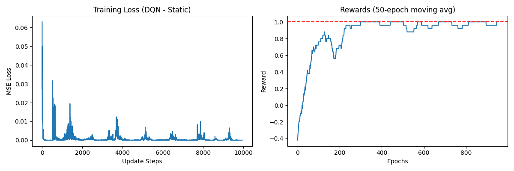
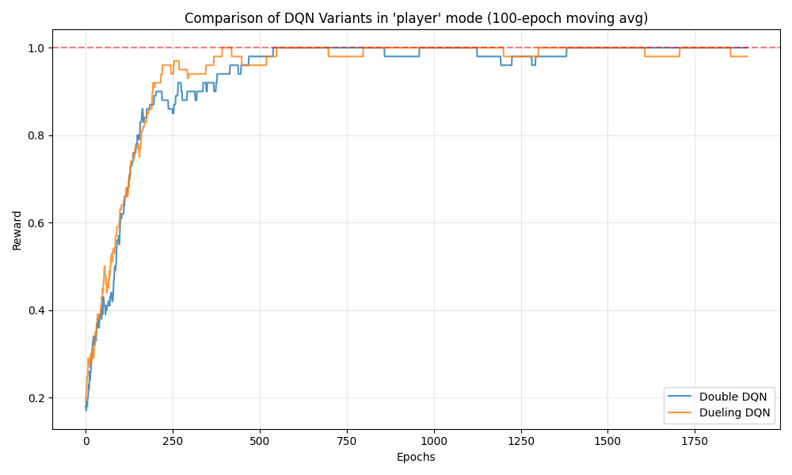
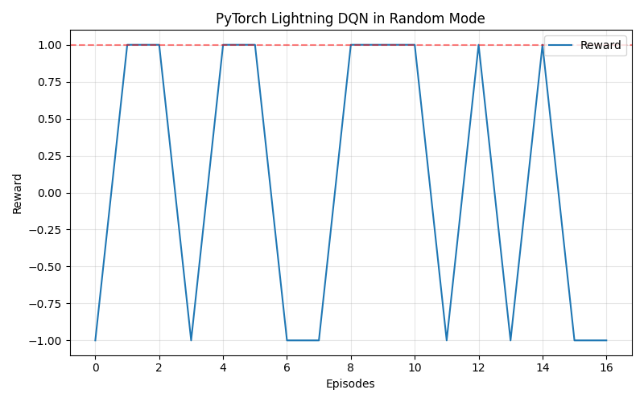

# 強化學習 HW3: DQN and its variants 🧠

本專案為強化學習 Homework 3 的實作，基於 [DeepReinforcementLearningInAction](https://github.com/DeepReinforcementLearning/DeepReinforcementLearningInAction) 的 Gridworld 環境，探討並實作了不同變體與進階技巧的 Deep Q-Network (DQN)。

## 實驗環境 (Gridworld)

我們處理三種不同難度的 GridWorld 模式：
1. `static`: 靜態模式。玩家固定在 (0,3)，終點與陷阱也固定。
2. `player`: 玩家起始位置隨機，其餘物件固定。
3. `random`: 所有物件 (玩家、終點、陷阱、牆壁) 位置全隨機。

---

## 🚀 HW3-1: Naive DQN (Static Mode)

在最簡單的 `static` 模式中，我們實作了基礎的 DQN，並加入了 **Experience Replay Buffer** 來打破資料間的相關性。

- **執行指令**: `python hw3_1_dqn_static.py`
- **架構特點**: 基本的 3 層全連接層神經網路。
- **訓練結果**:
  因為環境是靜態的，DQN 可以非常快速地記下最佳路徑並達到收斂 (Reward = 1.0)。



---

## ⚖️ HW3-2: Enhanced DQN Variants (Player Mode)

針對難度提升的 `player` 模式，我們實作了兩種強化的 DQN 架構並進行比較：

1. **Double DQN**: 解決了傳統 DQN 容易「高估 Q 值」的問題。我們使用線上網路 (Online Net) 選擇動作，並用目標網路 (Target Net) 來評估該動作的 Q 值。
2. **Dueling DQN**: 將神經網路架構拆分成「狀態價值 (State Value)」與「優勢函數 (Advantage)」。這讓模型在面臨不需要特別選擇特定動作的狀態時，能更有效地學習。

- **執行指令**: `python hw3_2_variants_player.py`
- **比較結果**:
  Dueling DQN 通常在探索初期就能更快抓到狀態好壞，而 Double DQN 的收斂則較為平穩。兩者在隨機起點的環境下都能成功收斂。



---

## 🔁 HW3-3: Enhance DQN for Random Mode WITH Training Tips

`random` 模式是最困難的挑戰，我們使用 **PyTorch Lightning** 進行重構，並加入了實用的訓練技巧來提昇穩定性：

- **PyTorch Lightning**: 讓程式碼結構更清晰、簡潔。
- **Gradient Clipping (梯度裁剪)**: 防止在隨機生成的極端地圖中，產生過大的 Loss 導致模型崩潰 (`gradient_clip_val=1.0`)。
- **Learning Rate Scheduling**: 隨著訓練 Epoch 增加，逐步調降學習率 (StepLR)，讓模型在後期訓練中能收斂得更細緻。

- **執行指令**: `python hw3_3_lightning_random.py`
- **訓練結果**:



---

## 🌈 HW3-4: Rainbow DQN 分析與教學 (Bonus)

為了在最高難度的 `random` 模式中取得最好的效果，DeepMind 提出了結合 6 大技術的 **Rainbow DQN**。本專案包含了一份深入的分析與實作教學：

👉 **[詳細教學請見：hw3_4_rainbow_analysis.md](./hw3_4_rainbow_analysis.md)**

教學中涵蓋了：
1. Rainbow 核心組件分析 (Double, Dueling, PER, Multi-step, Distributional, Noisy Nets)。
2. 如何在現有程式碼中實作投資報酬率最高的 **Mini-Rainbow (Double + Dueling + PER + Multi-step)**。

---

## 🛠️ 安裝與執行

本專案使用 `uv` 進行套件管理，您可以使用以下指令快速啟動並執行：

```bash
# 安裝所需套件 (確保安裝了 PyTorch, Matplotlib, PyTorch Lightning)
uv pip install torch matplotlib pytorch-lightning numpy

# 依序執行測試
uv run hw3_1_dqn_static.py
uv run hw3_2_variants_player.py
uv run hw3_3_lightning_random.py
```
